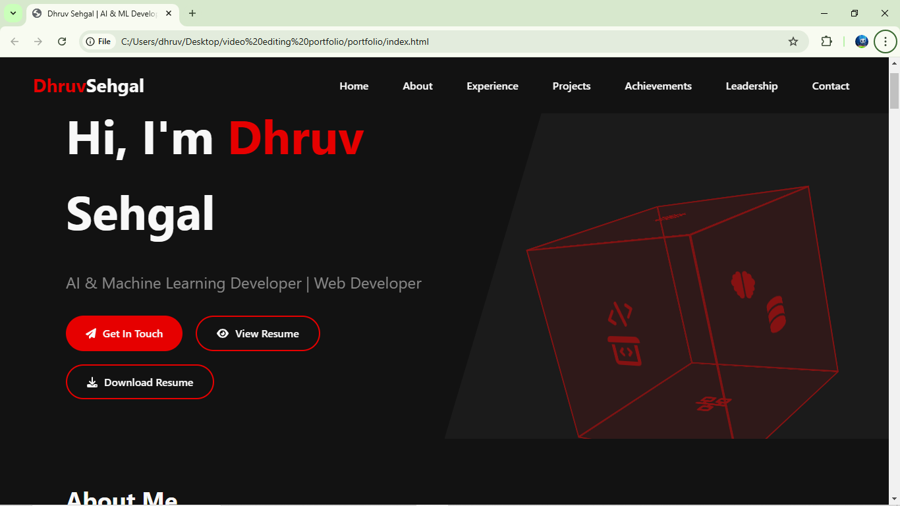
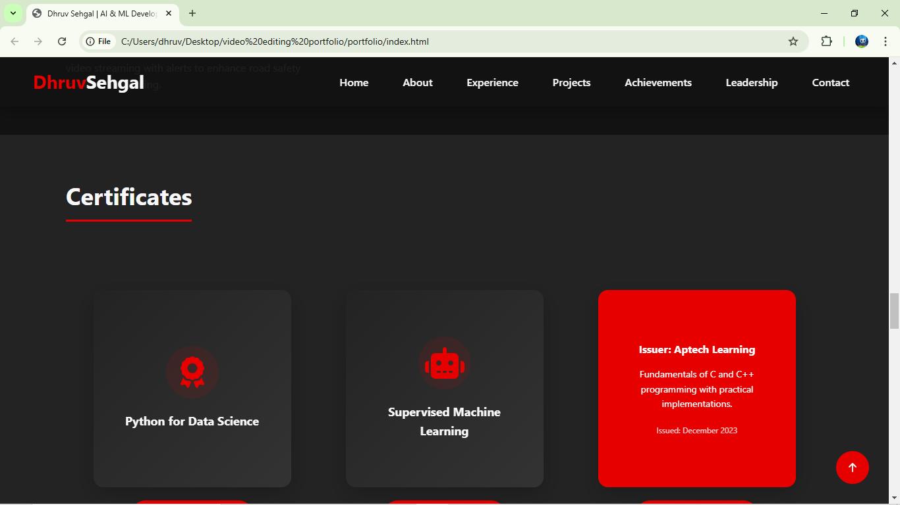
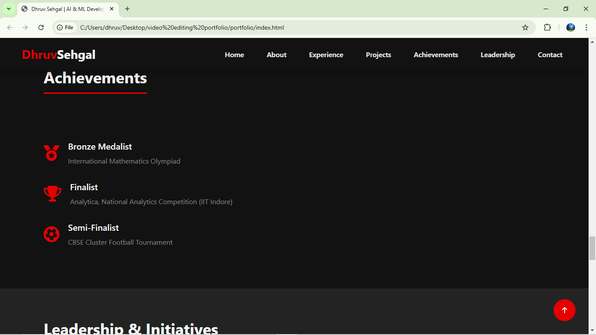

# Dhruv Sehgal | Portfolio Website 🌐

Welcome to my personal portfolio website — a vibrant showcase of who I am, what I do, and the projects I've built with passion, code, and a little bit of animation magic 🎨💻.

## 🌍 Live Demo

[🔗 Visit My Live Portfolio](https://dhruv-shgal.github.io/Portfolio/)

## 🚀 About Me

I'm **Dhruv Sehgal**, a Computer Science Engineering student specializing in **Artificial Intelligence and Machine Learning**. From developing real-time drowsiness detection systems to animating this very site, I enjoy blending creativity with code to build impactful solutions.

🔧 Technologies I work with:
- **Frontend**: HTML, CSS, JavaScript, Anime.js
- **Backend**: Python (Flask), Node.js
- **Databases**: MongoDB, MySQL, SQLite
- **Tools**: Git, Photoshop, Premiere Pro
- **AI/ML**: TensorFlow, Keras, OpenCV, Scikit-learn

📫 [Contact Me](mailto:dhruvsehgal2004@gmail.com) | 🌐 [LinkedIn](https://linkedin.com/in/dhruv-sehgal-a95058268) | 🧠 [GitHub](https://github.com/dhruv-shgal)

---

## ✨ Features of This Website

- Smooth and interactive **scroll-based animations** powered by `anime.js`
- Responsive design with HTML, CSS, and vanilla JavaScript
- Animated project cards, glowing button effects, and fade-in sections
- Dynamic theme with professional design aesthetics
- Fully accessible and lightweight

---

## 💼 Portfolio Highlights

### 🔍 Stock Price Prediction
> Web app using LSTM for time-series forecasting, served via Flask with a user-friendly interface.

### 🔊 Fake vs Real Audio Classification
> CNN + Librosa to detect deepfake audio — 87% accuracy with real-time prediction UI.

### 🚆 RAIL – संरक्षक
> AI-powered complaint management system using multimedia classification with TensorFlow.

### 💤 Alertic – Drowsiness Detection
> Real-time OpenCV facial monitoring to prevent driver fatigue accidents — 90%+ accuracy.

Explore more on [my GitHub](https://github.com/dhruv-shgal).

---

## 🛠️ Built With

- [Anime.js](https://animejs.com/) - JavaScript Animation Engine
- HTML5 & CSS3 - Core web structure & styling
- JavaScript (ES6) - Interactive behavior
- Git & GitHub - Version control and collaboration

---

## 📸 Screenshots

### 🔹 Homepage


### 🔹 Certificates  Section


### 🔹 Achievements Section


---

## 📂 Project Structure

```bash
.
├── index.html
├── style.css
├── script.js
├── assets/
│   └── images, icons, animations
├── README.md
└── LICENSE
```

---

## 🧩 Future Improvements

- Add dark mode toggle
- Integrate project filtering by tags
- Implement a contact form with backend support

---

## 📜 License

This project is open source and available under the [MIT License](LICENSE).

---

## 💬 Feedback

Have suggestions? Open an issue or connect with me on [LinkedIn](https://linkedin.com/in/dhruv-sehgal-a95058268)!

---

Thanks for visiting my digital home. 🚀
